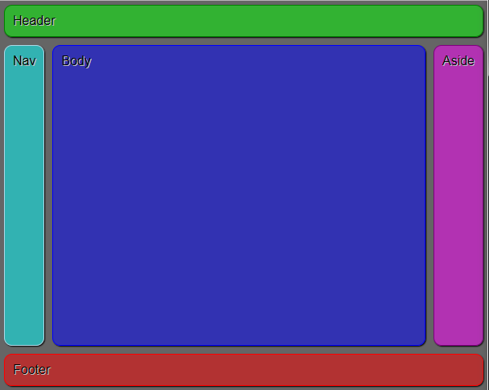

# CSS grid layout in production

## What?

## How?

## Why?

## Holy grail layout

[Demo](https://zs.github.io/powergrid/?q=eyJuYW1lIjoiUG93ZXIgR3JpZCIsInZlcnNpb24iOiIwLjEuMCIsInVybCI6Imh0dHBzOi8vZ2l0aHViLmNvbS9aUy9wb3dlcmdyaWQvIiwiY29scyI6WyJhdXRvIiwibWlubWF4KG1pbi1jb250ZW50LDFmcikiLCJhdXRvIl0sInJvd3MiOlsiYXV0byIsIm1pbm1heChtaW4tY29udGVudCwxZnIpIiwiYXV0byJdLCJjZWxscyI6W3sidGV4dCI6IkhlYWRlciIsImNvbFNwYW4iOjMsImNvbCI6MSwicm93IjoxfSx7InRleHQiOiJOYXYiLCJjb2wiOjEsInJvdyI6Mn0seyJ0ZXh0IjoiQm9keSIsImNvbCI6Miwicm93IjoyfSx7InRleHQiOiJBc2lkZSIsImNvbCI6Mywicm93IjoyfSx7InRleHQiOiJGb290ZXIiLCJjb2wiOjEsInJvdyI6MywiY29sU3BhbiI6M31dLCJwcmVmaXgiOiJwZy0ifQ==)