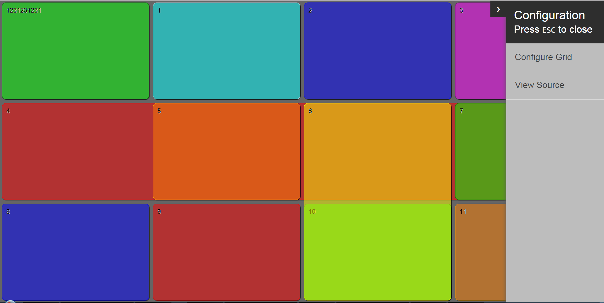

# Powergrid

### About
CSS Grid layout is the latest and most powerful known layout system available in CSS. It can handle both rows and columns that's why also known as 2-dimensional sytem. It has solved many problems that we have come across or tried to hack them around using properties like positioning, floats, inline-block, etc while creating a layout. 

As its a new system, it could be difficult for the newbies and also for those who are not much into CSS to create layout using CSS Grid. So we require something that helps us understand about CSS Grid and also to create a layout using it. So we have Powergrid as a solution to these problems.     

Powergrid is an easy to use yet a powerful tool to readily build a cross-browser CSS Grid system. It provides a simple interface where we can create our own grid without thinking much about browser compatibility. We can also learn about CSS Grid while playing around with this tool as it also provides the source code of the built Grid.   

### How to install
  - Clone the repository using `git clone https://github.com/ZS/powergrid.git` command or [download zip](https://github.com/ZS/powergrid/archive/master.zip).
  - Run `npm install` command after downloading/cloning the repository.

### Usage:
  - Open index.html in the browser.
  - See the Grid built using default configuration.
  - You can build your own customized Grid by clicking "Configure Grid" option on the configuration panel.
  - View the source code (HTML and CSS) of the built Grid from "View Source" option on the configuration panel and you can also copy it.

### Test
  - Open in browser test/index.html.

### Issues and bug reporting 
Please feel free to add a bug / feature request / suggestions to the [issue tracker](https://github.com/ZS/powergrid/issues). 

### References
Please check our [branch](https://github.com/ZS/powergrid) to get upcoming versions and features.

Also check [change.log](https://github.com/ZS/powergrid/wiki/Changelog) for more detailed information about new features, bug fixes and releases.

